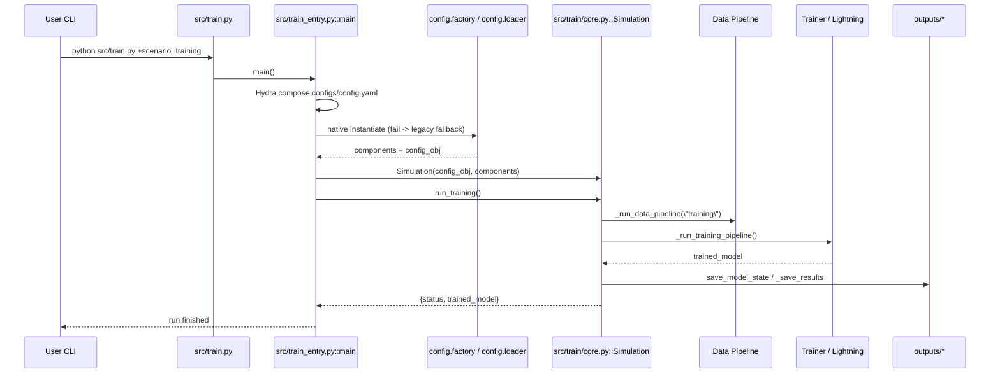
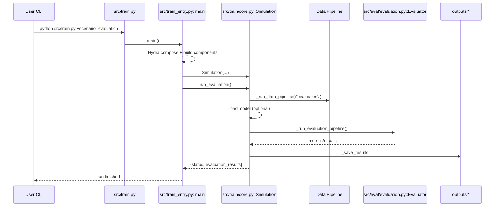
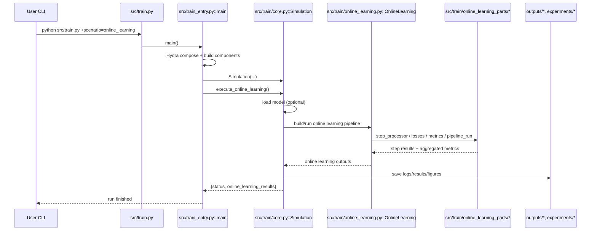

# DOA 项目结构说明（SubspaceNet_Update）

## 1. 项目整体结构（按职责分层）

```text
SubspaceNet_Update/
├── src/                     # 主代码（当前推荐主链路）
│   ├── train.py             # 运行入口包装（调用 train_entry.main）
│   ├── train_entry.py       # Hydra 主入口（native-first + legacy fallback）
│   ├── train/               # 训练编排、在线学习、运行时组件
│   ├── models/              # LightningModule 及模型组件
│   ├── data/                # 数据模块、trajectory 数据处理
│   ├── eval/                # 评估流程与指标
│   ├── methods_pack/        # MUSIC/ESPRIT/MLE 等子空间算法实现
│   └── utils/               # 通用工具（日志、IO、绘图等）
├── config/                  # 强类型配置 schema + loader + component factory
├── configs/                 # Hydra 配置中心（config.yaml + 各子配置组）
├── simulation/              # 卡尔曼滤波、场景运行器、仿真相关逻辑
├── tests/                   # 集成测试、在线学习测试、Kalman 测试
├── docs/                    # 文档（规划、论文、参考资料等）
├── notebooks/               # 实验与可视化 notebook
├── data/                    # 原始/处理后数据
├── outputs/                 # 训练输出（模型、日志、图表）
├── experiments/             # 实验过程产物和调试日志
├── main.py                  # 旧 CLI 入口（兼容路径）
└── DCD_MUSIC/               # 子模块/外部算法依赖
```

## 2. 每个部分在做什么

- `src/train_entry.py`
  - 当前训练主入口。
  - 使用 Hydra 组合配置，优先走 native 组件实例化；失败时回退 legacy config bridge。

- `src/train/core.py`
  - `Simulation` 总控类，编排训练、评估、在线学习三条主流程。
  - 串起 data pipeline、model load/save、trainer 调用与结果落盘。

- `src/data/`
  - 负责数据生成、数据加载、trajectory 数据处理。
  - `lit_datamodule.py` 对接 Lightning 数据接口。

- `src/models/` + `src/models_pack/`
  - `models/` 侧重 Lightning 训练适配（如 `lit_module.py`）。
  - `models_pack/` 侧重具体网络/算法模型实现（SubspaceNet、DCD-MUSIC 等）。

- `src/train/online_learning.py` + `src/train/online_learning_parts/`
  - 在线学习主流程及拆分后的子模块（loss、metrics、step processor、pipeline）。
  - 是近期重构较多的区域之一。

- `src/eval/`
  - 评估流程与指标计算（RMSPE、RMAPE、Kalman 相关损失等）。

- `config/` + `configs/`
  - `config/`：Python 侧配置对象、解析与组件工厂。
  - `configs/`：YAML 配置源，按 dataset/model/training/simulation/runtime 等分组。

- `simulation/`
  - 仿真与滤波相关逻辑（EKF/Batch EKF/模型定义/runner）。

- `tests/`
  - `tests/integration/`：入口与桥接层面回归。
  - `tests/online_learning/`：在线学习重构后的契约测试。
  - `tests/kalman_filter/`：滤波器功能测试。

- `main.py`
  - 旧命令行入口，当前主要用于兼容与回滚，不是首选开发入口。

## 3. 哪些是核心部分（建议优先理解）

### A. 运行主链路核心（最高优先级）

1. `src/train.py`
2. `src/train_entry.py`
3. `src/train/core.py`
4. `config/schema.py` + `config/factory.py`
5. `configs/config.yaml`（及其 defaults 指向的配置组）

这条链路决定了“配置如何生效、组件如何实例化、训练/评估如何被调度”。

### B. 任务能力核心（按你的研究目标）

- 如果你主要做训练与模型：`src/models/`, `src/models_pack/`, `src/train/training.py`
- 如果你主要做 trajectory/near-field 问题：`src/data/trajectory.py`, `src/train/online_learning_parts/`
- 如果你主要做评估对比：`src/eval/`, `simulation/losses/`

### C. 当前技术债/重构敏感区

- `src/train_entry.py`（native 与 legacy 双路径并存）
- `src/train.py` 与 `src/train/` 的命名历史问题（已做兼容拆分）
- `online_learning` 主文件与 `online_learning_parts` 的边界持续收敛中

## 4. 一句话理解这个仓库

这是一个以 **Hydra + Lightning + Subspace/DOA 算法** 为核心的训练与仿真仓库：
- `src/train_entry.py` 决定“怎么跑”；
- `src/train/core.py` 决定“跑哪些阶段”；
- `src/data`/`src/models`/`src/eval` 决定“具体做什么”。

## 5. 从命令到代码调用链（时序图）

下面三条链路都以 Hydra 入口为起点：`python src/train.py +scenario=...`

### 5.1 训练链路（`+scenario=training`）



### 5.2 评估链路（`+scenario=evaluation`）



### 5.3 在线学习链路（`+scenario=online_learning`）



### 5.4 场景分发规则（在 `src/train_entry.py`）

- `scenario=training` -> `Simulation.run_training()`
- `scenario=evaluation` -> `Simulation.run_evaluation()`
- `scenario=online_learning` -> `Simulation.execute_online_learning()`
- `scenario=full` -> `Simulation.run()`（串行执行训练/评估/在线学习）
- 若配置了 `runtime` `_target_`，优先走 `runner.run()`，再由 runner 调用 `Simulation` 对应方法
