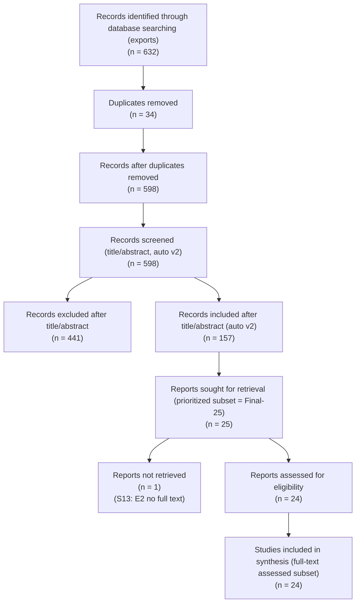
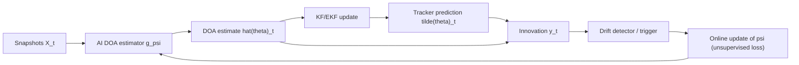
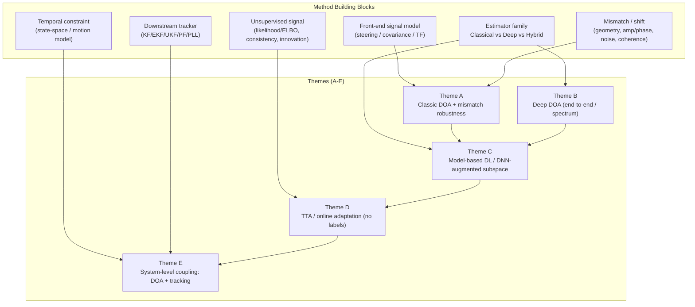

# 图示清单（Figures Checklist）

本文件提供“可提交版综述”建议配图清单与内容要点。若暂时无法生成最终图片，可先在正文中引用本文件的编号作为占位符。

说明：
- `literature-review` 技能文档建议至少 1-2 张图。当前仓库未内置 `scientific-schematics` 相关脚本，因此这里给出“内容定义 + mermaid 占位图”，后续可替换为矢量图（PDF/SVG）。

---

## Fig. 1：PRISMA/筛选流程图（正式口径：export 去重 -> auto v2 -> prioritized full-text）

说明：
- 本图数字来自 `docs/literature/screening_criteria.md` 的 **4E**（正式口径）。
- `Reports sought` 目前为 prioritized subset（Final-25），用于把流程推进到“可提交的 full-text assessed”版本；并不等同于对全部 `n=157` 逐篇完成全文获取。

成品图（PNG，可用于 PDF）：

---

## Fig. 2：系统级框架图（DOA + Tracking + Innovation-Driven Adaptation）

建议内容：
- 输入：快拍 `X_t`（或协方差/特征）
- DOA 模型：`g_psi(X_t) -> \hat{theta}_t`
- 跟踪器：KF/EKF 产生预测 `\tilde{theta}_t`
- innovation/residual：`y_t = \tilde{theta}_t - \hat{theta}_t`
- 触发器：窗口统计超过阈值触发更新
- 更新：用 innovation-consistency 损失更新 `psi`

成品图（PNG，可用于 PDF）：

---

## Fig. 3：方法谱系/分类图（Taxonomy）

建议将方法按两条维度组织：
- 估计器：Classical vs Deep vs Model-based DL（SubspaceNet/unfolding）
- 适配策略：无适配 / 有监督在线 / 无监督信号（物理一致性、谱代理、innovation）

产出形式建议：二维矩阵或树状图，并在综述“主题综合”中反复引用。

成品图（PNG，可用于 PDF）：

---

## Fig. 4（可选）：漂移类型与评估协议图（Benchmark Protocol）

建议列出：
- 漂移注入：阵元间距偏移、相位漂移、互耦、几何噪声、多径变化、SNR 变化、快拍数变化
- 场景动态：源数变化/源运动模型（RW/非线性/机动）
- 指标：RMSPE/RMAPE、innovation 统计、跟踪稳定性、触发频率、更新步数成本
