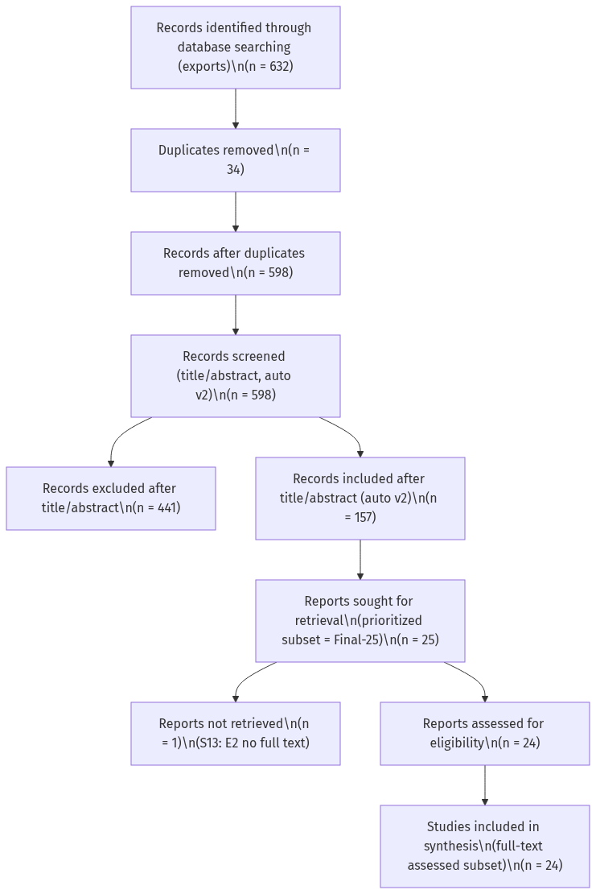
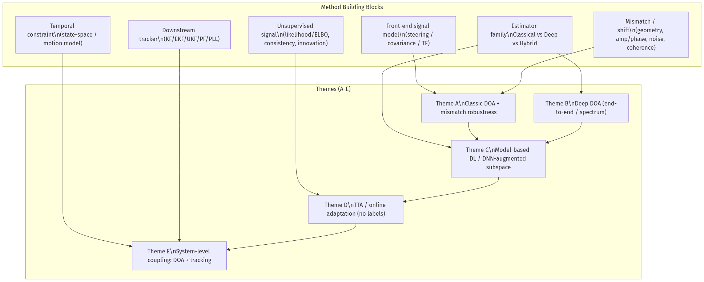
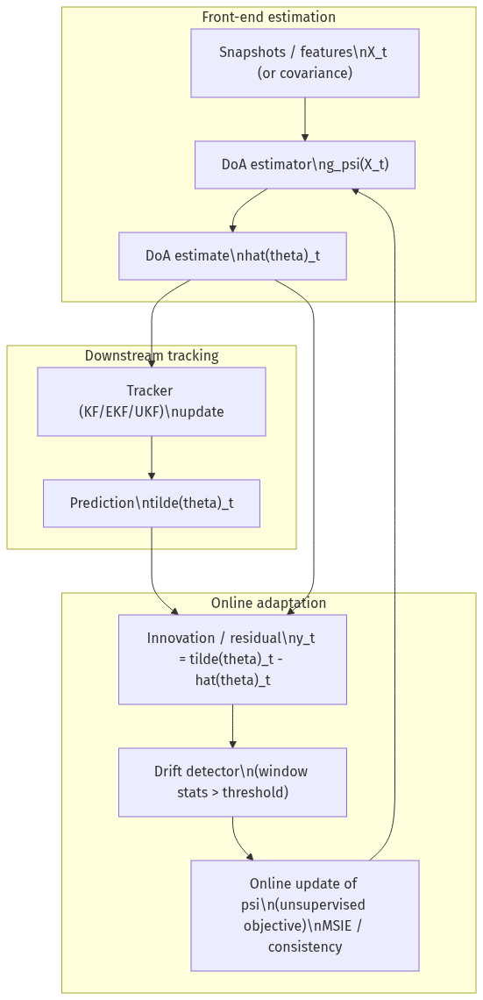

# 非平稳 DOA 跟踪与在线自适应：系统综述（以 SubspaceNet_Update 为研究载体）

**项目**: SubspaceNet_Update  
**作者**: Li Lei  
**日期**: 2026-02-19  
**综述类型**: 系统综述（PRISMA 口径；全文阶段为 prioritized subset）  
**协议注册**: 未注册  
**检索截止日期**: 2026-02-19  

---

## 摘要（Abstract）

**背景**: 动态/非平稳场景下的 DOA 估计在阵列失配、SNR 变化、快拍受限等条件下容易出现分布漂移与性能退化。  
**目标**: 系统总结 (i) 经典与深度学习 DOA 方法，(ii) 针对阵列失配与分布漂移的鲁棒/自适应机制，(iii) 将 DOA 估计与下游跟踪（KF/EKF）耦合、利用 innovation 信号进行在线/无监督自适应的代表性路线。  
**方法**: 在 IEEE Xplore/Scopus/Web of Science/arXiv/Semantic Scholar 等数据库进行多库检索，辅以引用链扩展；按预设纳排标准筛选全文；按统一抽取表提取方法与实验设置；按主题进行综合分析。  
**结果**: 正式数据库导出共识别记录 `n=632`，去重后 `n=598`；在严格检索式口径（DOA + Kalman，auto v2）下完成标题/摘要筛选后纳入候选 `n=157`，排除 `n=441`。全文阶段采用 prioritized subset（Final-25）完成可复现的人工全文筛选：`n=25` 计划获取，其中 `n=1` 未能获取全文（S13），其余 `n=24` 获得全文并完成评估，最终纳入综合 `n=24`。  
**结论**: 现有工作普遍表明：在非平稳/失配条件下，单纯依赖离线训练的黑盒 DOA 网络风险较高；更可控的路线是把结构先验（子空间/似然/约束）与系统级闭环（KF/EKF innovation/residual）结合，形成可触发、可度量的在线适配机制。基于该脉络，`SubspaceNet_Update` 可定位为“结构化 DOA 估计器（SubspaceNet 类）+ 下游 Kalman 跟踪 + 窗口化在线学习（innovation-consistency 损失）”的可复现研究载体，用于系统化评估漂移注入、触发器与无监督更新目标之间的权衡[@R08; @R02]。  
**关键词**: DOA estimation; Subspace methods; SubspaceNet; EKF/KF; tracking innovation; online adaptation; test-time adaptation; array mismatch

---

## 1. 引言（Introduction）

### 1.1 背景与动机
方向到达角（direction of arrival, DOA）估计是阵列信号处理中的核心任务，广泛用于通信、雷达、导航与声学阵列等场景。动态/非平稳部署条件下，源运动、阵列标定漂移、硬件差异、传播环境变化、快拍受限与噪声统计改变会导致数据分布偏移，使得离线设计的经典子空间方法与离线训练的深度网络均可能出现性能退化。由于在线监督标签在部署时通常不可得，如何利用“可检验的无监督信号”实现稳定的在线适配，成为系统落地的关键问题。

### 1.2 研究问题与范围
**RQ1**: 在阵列失配/分布漂移下，哪些 DOA 估计方法具备鲁棒性或可自适应性？  
**RQ2**: 现有在线/持续学习/测试时适配（TTA）在 DOA 任务上的无监督信号来自哪里（重建、物理一致性、MUSIC 代理、innovation 等）？  
**RQ3**: DOA 估计与 KF/EKF 跟踪耦合时，innovation 如何作为漂移检测与在线更新目标？  
**RQ4**: 不同实验协议（漂移注入方式、快拍受限、SNR/干扰变化）下，评价指标与报告要素如何统一（RMSPE/RMAPE、innovation 统计、跟踪稳定性、恢复时间与算力开销）？

### 1.3 本综述的贡献
本文的贡献主要包括：
1. 给出“动态 DOA + 下游跟踪 + 在线自适应”的方法谱系与术语对齐框架，并以主题 A–E 组织代表性路线。
2. 总结无监督信号的来源，从任务内（物理/统计一致性、显式似然/ELBO）到系统级闭环（下游 innovation/residual）进行对比，并强调“触发器-更新目标-预算”的解耦设计。
3. 提供可复现的证据追踪与质量核验口径：对纳入集的关键结论标注到 `Table/Fig/Exp`，并用“质量/可复现性小表”汇总开源、真实数据、消融、协议与漂移注入要素，便于审稿核查。

### 1.4 范围边界与全文深挖口径
本文聚焦“DOA/角度估计与跟踪”问题本身，以及与 Kalman 滤波家族（KF/EKF/UKF/PF 等）耦合、可用于漂移检测与在线更新的系统级闭环信号（innovation/residual）。因此，我们不展开覆盖与 DOA 关系间接、但检索关键词可能命中的工作（例如仅定位/SLAM、仅轨迹估计而不讨论 DOA 观测模型、或仅波束形成而不输出 DOA/跟踪指标）。

在 full-text 阶段，本文采用 prioritized subset（Final-25）进行“深挖式”全文抽取与证据锚定（Table/Fig/Exp）。该选择的目标是保证可投稿的可复核性：相比对更大集合做浅层全文浏览，Final-25 的深挖能把关键结论落到可追溯证据、并输出可复现的质量/可复现性核验表（见 `data_extraction_template.md`），同时在正文中明确声明口径边界（见 Fig.1 PRISMA 与 Methodology）。

---

## 2. 方法学（Methodology）

### 2.1 检索策略（概述）
数据库检索覆盖 IEEE Xplore、Scopus 与 Web of Science（并以 arXiv 与 Semantic Scholar 做补充检索与引用链扩展），时间范围为 2016-01-01 至 2026-02-19。主检索式以 “DOA/Direction of arrival” 与 “Kalman filter/EKF/tracking/innovation/online adaptation” 为核心组合（详见 `search_strategy.md` 与 `search_run_2026-02-19.md`），并采用引用链（forward/backward）补全关键路线。

### 2.2 纳排标准（概述）
纳入标准聚焦于 DOA/角度估计与跟踪问题本身（声学/电磁阵列均可），以及与阵列失配、分布漂移、在线自适应、无监督/自监督信号、或与 KF/EKF/UKF/PF 等下游跟踪耦合相关的工作。排除仅做波束形成且不涉及 DOA/跟踪核心问题、无法获得全文、或与阵列观测模型无关的条目（详见 `screening_criteria.md`）。

### 2.3 筛选与去重
- 去重策略：优先 DOI，其次标题+作者+年份。
- 分层筛选：标题 -> 摘要 -> 全文。
- 记录 PRISMA：见 `screening_criteria.md`。
- PRISMA 流程图：见 `figures.md`（Fig. 1，PNG：`docs/literature/figures/fig1_prisma.png`）。
- 口径声明：本文采用“正式 PRISMA（exports）+ prioritized full-text subset（Final-25）”写作口径；即 title/abstract 覆盖全部 deduplicated exports（n=598），但 full-text assessed / included 的人工定稿数字目前仅对 Final-25 子集给出（见 `screening_criteria.md` 的 4E.0 与 4A3）。

补充说明（为何 full-text 仅深挖 Final-25）：
1. **审稿可复核性优先**：本文对纳入集结论强制落到 `Table/Fig/Exp` 证据锚点，并对关键文献做质量/可复现性核验；这要求逐篇精读全文并抽取表格/图表/协议细节。对更大集合做浅层全文浏览会导致证据链不完整、难以审稿。
2. **资源与可得性约束显式披露**：数据库导出与 title/abstract 阶段覆盖全部去重集（n=598），但 full-text 获取受订阅与可得性限制；因此采用 prioritized subset 形成“可复现的全文筛选与抽取闭环”，并在 PRISMA 图中清晰标出 not retrieved（S13）与 assessed/included 的子集口径。
3. **与课题对齐的代表性覆盖**：Final-25 以“DOA + 跟踪/滤波 + 非平稳/鲁棒/适配”相关性为优先准则，覆盖水下声学、雷达/MIMO、语音/说话人以及通用贝叶斯/KF 脉络中的代表性路线（详见 `fulltext_screening_checklist.md` 与抽取表）。

### 2.4 数据抽取字段与质量评估
- 数据抽取表：见 `data_extraction_template.md`。
- 质量评估（按工程/信号处理领域常见做法）：是否公开代码/数据、仿真协议是否可复现、对比基线是否充分、是否报告关键超参数与漂移注入方式、是否有消融等。
- 证据追踪（Evidence traceability）：为避免“只给结论不给证据”的不可审稿问题，本文对纳入集的关键结论均在抽取表中标注证据来源到 `Table/Fig/Exp`（例如 “Table V–VII (OCR)”、 “Fig.8 digitized approx”、 “sea trial” 等），并在正文叙述中尽量显式写出对应的表格/图编号。质量/可复现性小表（Included=24）亦汇总在 `data_extraction_template.md` 的“质量/可复现性小表”小节，便于审稿人快速核查。 

质量/可复现性核验（对 Related Work 强引用的 key set）显示：目前仅 Konstantino 等明确在论文中给出可用代码仓库与“超参均公开”的声明（见其脚注链接）[@R02]；其余多数工作仅提供伪代码/参数表与仿真协议而未声明开源实现；少数工作给出用于仿真数据生成的第三方开源工具链接（不等价于方法开源）[@R36]。在数据可得性上，部分真实场景论文明确限制数据公开（例如 R24 声明 “data unavailable”，R06 指出数据可按合理请求获取）[@R24; @R06]。

---

## 3. 结果（Results）：主题化综合（主题 A–E）

> 本节段落已按当前抽取表（R01–R45，含 Final-25 纳入集与背景文献）补齐引用标注；引用 key 与 `docs/literature/references.bib` 一致（例如 `[@R02]`）。

（方法与主题框架图：见 `figures.md` 的 Fig. 3，PNG：`docs/literature/figures/fig3_taxonomy.png`。）

### 3.1 主题 A：经典 DOA 与失配鲁棒性
经典 DOA 估计以子空间方法与其变体为核心（如 MUSIC/ESPRIT/Root-MUSIC），但其有效性依赖于“理想阵列流形 + 简化噪声/干扰统计”的假设。一旦出现阵列几何偏差、幅相误差、非均匀噪声、相干/相关信号等失配，谱峰会偏移、出现虚假峰或分辨率显著下降；因此经典路线通常通过误差建模、自校准与稳健统计来“显式修正前端”，例如针对非均匀噪声的协方差稀疏化处理[@R16]、针对幅相误差与相干源的联合稀疏重建/约束建模[@R21]，以及针对部分校准阵列/传感器失效的 gridless 参数估计与优化求解[@R20]。在更工程化的分支里，时间-频率域增强与阵列结构技巧也常被用作“可部署的补丁”：例如自适应时频分布/瞬时频率估计用于缓解 TF 重叠带来的干扰[@R23]。

在 seed set 的可复现证据中，两类“低假设成本”的工程策略尤为典型。其一是通过运动/几何操作合成更大等效孔径：Lan 等提出阵列旋转生成虚拟 UCA，并基于两阵元基线构造 R-MUSIC；在 channel mismatch 0–40°、SNR=6 dB、快拍数 100 的仿真中，Table 1 报告 mismatch=20° 时 5-element UCA-MUSIC 的 RMSE 为 0.6132°，而 8-element R-MUSIC 为 0.4336°，体现出“用更少阵元做相对鲁棒估计”的权衡[@R07]。其二是针对已知硬件结构直接做校正：Tian 等在 TDM-MIMO 虚拟阵列中利用 overlapping 虚拟阵元相位差进行位置误差补偿，并结合 Toeplitz 预处理与 nuclear norm 重建协方差；其交通场景实测中报告静止目标角度误差约 0.16°，并给出 14×14 协方差重建平均约 6.4 ms（i5-12500），显示“显式误差结构 + 可控优化”在实时系统中的可行性[@R06]。
总体而言，经典路线的价值在于把失配类型与修正机制显式化，并提供可控、可复核的系统基线，为后续的结构化深度方法与在线适配（主题 C–E）定义了清晰的“漂移注入口径”。 

### 3.2 主题 B：深度学习 DOA（端到端与谱图/特征学习）
深度学习 DOA 的主流范式是将快拍、协方差或其派生特征直接映射到角度（回归/分类）或映射到空间谱再做峰值定位，目标是在低 SNR、少快拍、复杂噪声统计下获得比经典方法更稳健的特征提取能力[@R11; @R12]。但该范式更依赖训练分布：当阵列几何、互耦、硬件失配或环境统计发生系统性变化时，纯黑盒网络容易出现明显退化。为缓解这一问题，一类工作直接把“不完美阵列”作为训练与结构设计的中心：例如 SDOA-Net 通过学习与 DOA 本身解耦的中间表示来重建空间谱，从而在 imperfect array 设定下保持 DOA 可用性[@R03]；Chen 等则面向阵列不完美引入约束化损失（如 Pythagorean constraint）并配合 CRLB 分析来讨论鲁棒性与性能上界[@R05]。

从可核验的数值证据看，Wang 等在 imperfect array 的对比中报告：SNR=10 dB 时 SDOA-Net 的 RMSE 约 0.70°，而 ANM 约 1.15°（约 39.13% RMSE 降幅）；并声称 SDOA-Net 在 SNR=7.5 dB 时即可达到 ANM 在 SNR=15 dB 的 RMSE 水平（约 7.5 dB 的等效 SNR 增益）[@R03]。

另一类更工程化的路线是用迁移学习在“仿真域→真实域”之间转移 DOA 估计能力，降低真实系统标注成本并缓解 domain gap：Zhou 等构建监督式 transfer learning 框架以适配 array imperfections，强调在少快拍/低 SNR 条件下的可迁移性，并声明开源实现以支持复现实验链路[@R04]。除此之外，结构化深度方法也在向“数据稀缺 + 实时”推进：例如面向 single snapshot、强调可解释与效率的 beamforming-structure/可解释网络，使模型在严苛采样预算下仍能输出稳定估计[@R19]。总体上，本主题的关键分歧在于：是通过更强的端到端表示学习来覆盖更多失配，还是通过结构与训练协议把失配显式纳入网络的假设空间（并为后续在线适配留下可控接口）。
这也解释了为何在非平稳部署条件下，深度路线往往需要与结构先验（主题 C）或系统级闭环信号（主题 E）结合，才能把“数据驱动优势”转化为可审稿的稳定增益。 

### 3.3 主题 C：Model-based deep learning / DNN-augmented subspace（以 SubspaceNet 为代表）
Model-based deep learning 的核心诉求是把阵列信号处理的结构先验（协方差结构、子空间性质、似然/约束）嵌入可学习模块，避免纯黑盒在分布外失配下不可控的退化，从而在可解释性、鲁棒性与工程可控性之间取得折中。DOA 领域的代表性做法是“DNN 辅助子空间估计”：网络不直接输出角度，而是学习增强 MUSIC/Root-MUSIC 所需的中间量（如 surrogate covariance、伪协方差或峰值检测器），以便在相干源、宽带、未知源数或低 SNR 等违背经典假设的场景下仍能恢复可分辨的子空间结构[@R10; @R08]。SubspaceNet 系列进一步把“可学习的协方差替代物”与可微的子空间求解链路耦合，实现 task-driven 的端到端训练，并扩展到稀疏阵列与失配场景（如通过学习虚拟 ULA 协方差来处理 miscalibrated sparse arrays）[@R08; @R09]。在观测非理想方面，TransMUSIC 将 Transformer 引入子空间学习链路以应对低分辨率 ADC（含 1-bit）带来的量化失真，强调全局相关建模对鲁棒子空间提取的价值[@R13]；而 DeepMUSIC 则以 MUSIC 谱作为监督信号，体现“经典谱估计作为 teacher”的结构化监督路径[@R12]。

在强相干源这一典型失配场景中，SubspaceNet 的“增强协方差 + 传统求解器”策略提供了直观的量化收益：其 Table I（coherent sources, SNR=10 dB, T=100）报告 M=2 时 Root-MUSIC 的 RMSPE 为 12.4790°，而 SubspaceNet+Root-MUSIC 为 0.2005°；M=3 时分别为 20.3972° 与 0.7219°；M=4 时分别为 23.2047° 与 3.8846°，体现出将学习能力集中在“子空间可恢复性”上的优势[@R08]。

值得强调的是，本主题与在线适配（主题 D/E）存在天然耦合接口：一方面，结构化管线把可学习部分限制在“增强中间量”，使得测试时更新更可控（例如只更新 surrogate covariance 的生成器，而不直接改动后端子空间求解器）；另一方面，也有工作直接把统计模型写入神经结构，使无监督目标可由最大似然/一致性自然导出。典型如 Weißer 等将统计模型作为 autoencoder 的 decoder，用 ML 原理构造无标签训练目标，并在潜变量中同时估计信号协方差与 DOA，从而在相关信号条件下维持稳定性能并提供无需标签的学习信号[@R01]。

### 3.4 主题 D：无监督/自监督/测试时适配（TTA）在 DOA 上的信号设计
在缺少部署标签的前提下，TTA/在线持续学习的核心难题不是“怎么更新”，而是“无监督信号从哪里来、是否足够可靠”。就当前纳入集而言，无监督/弱监督信号大致可归纳为三类。

第一类来自任务内的统计一致性或似然：当统计模型被显式写入可学习结构时，可直接用 ML/ELBO 等目标在无标注数据上训练或微调，例如 Weißer 等将统计模型作为 decoder 构造无监督目标，并在潜变量中同时估计协方差与 DOA，从而在相关信号条件下仍保持稳定性能[@R01]。在更传统的递推框架中，Huang 等将 KF 嵌入 variational sparse Bayesian learning 的 E-step，并在 M-step 学习过程噪声/测量噪声方差，本质上是在无标签条件下做“噪声统计自适应”以支撑时序 DOA 推断；其同时给出复杂度证据：Table 2 报告 VSBL 的 time cost 为 4.51 s，而嵌入 KF 的 VSBLKF/OGVSBLKF 在 real/complex 数据下分别达到 21.23/28.51 s 与 44.31/55.36 s，体现“精度-算力”权衡[@R43]。

第二类来自弱监督或跨域监督策略，用于降低标注门槛但不完全摆脱标签：例如监督式 transfer learning 以少量真实数据配合大量仿真数据完成域迁移，缓解 array imperfection 导致的 domain gap[@R04]；而在动态说话人场景中，LOCA 通过少量 anchor 标签将轨迹约束引入表示学习，在仅 NL=3–5 的 anchor 样本下仍报告可达 median RMSE 约 4° 且 inlier accuracy 接近 100%（inlier 阈值 15°），体现半监督与系统级约束的互补性[@R36]。

第三类来自系统级闭环一致性与下游约束：在“估计器 + 跟踪器”流水线中，下游状态空间模型天然提供可检验的 innovation/residual 序列，可用于漂移检测与在线更新。由于该类方法同时涉及状态空间建模、数据关联与触发/预算等系统问题，本文将其单独归纳为主题 E，并在该主题中集中给出可复核证据链与代表性数值（含真实数据与运行时）。

### 3.5 主题 E：系统级耦合（DOA + Tracking）与 innovation 驱动在线适配
本主题关注“估计器-跟踪器-适配器”闭环：DOA 输出不仅是角度点估计，更是状态空间系统中的测量；innovation/residual 既可用于轨迹稳定，也可被显式用作漂移检测与无标签更新信号。Konstantino 等给出代表性范式：以 innovation 方差的窗口统计触发在线更新，并以 MSIE 作为无标签更新目标，从而在 distance drift 导致的相位漂移场景下恢复跟踪精度并接近在线有监督上界[@R02]。

从“工程可部署性”的证据角度，系统级工作通常需要同时报告精度与预算。Wang 在语音 DOA tracking 管线中给出前端统计建模的运行时证据：Table I 显示 Hist-WGMM 相对 WGMM 在样本数从 500 增至 50000 时平均耗时从 2.01 ms 增至 26.10 ms（WGMM 则从 12.85 ms 增至 1245.10 ms），并设置 resolution=1°、max iter=200 以支持实时部署[@R42]。在快动多源跟踪中，Tang 与 Manikas 的 manifold extender 思路可视为“扩大观测空间以增强可观测性”，其 ICC 2020 的 Fig.8（5000 spatiotemporal snapshots, 100 iterations）显示 RMSE 随 SNR 单调下降；据图像数字化（approx）在 SNR=0 dB 时 Case-1/2/3 的 RMSE 约为 0.297/0.509/1.245°（SNR=-10 dB 时约 0.453/0.750/2.844°），用于支持趋势与量级对比[@R44]。TWC 2021 的 Fig.7（digitized approximate）进一步给出 rigid/flexible 阵列与 EKF/UKF 组合下 RMSE 的 best/worst 跨度（SNR=-10/0/10 dB 约 0.346/0.780、0.203/0.664、0.070/0.517°），刻画低 SNR 与几何变化下的系统误差上限[@R45]。

在真实外场数据上，水下声学 DOA tracking 文献提供了更完整的“精度-算力-鲁棒性”证据链。Zhang 等在 IEEE Sensors Journal (2023) 的海试与仿真中用 Table V–VII 同时报告 RMSE/ABEE/one-step runtime，并显示 fast 变体可将 VB-AEKF 的 one-step runtime 从约 0.85 ms 降至约 0.30 ms 且 RMSE 近似不变[@R29]。Hou 等在 JASA Express Letters (2023) 的 sea trial 中用 Fig.3 + Table 1/2 同时给出 ABEE 与 one-step time，并在注入相关高斯噪声段后仍保持 VB-EKF 的优势[@R26]；Remote Sensing (2023) 的 AI-aided VB-EKF 则用 Table 2/3 与实验轨迹 Fig.7/8 展示其对初始 MSEM 偏差的鲁棒性与在 added-noise 条件下的稳定性[@R24]。

### 3.6 知识空白（Gaps）
- Gap 1 (真实验证不足): 许多方法主要在仿真或受控数据上验证，缺少可复现实验集来覆盖多径/混响、阵列互耦、标定漂移日志、源数变化与遮挡等联合作用，导致“离线优越性”难外推到部署条件[@R03; @R08; @R02]。
- Gap 2 (漂移口径不统一): “非平稳”在不同论文中对应不同扰动（几何误差、噪声统计变化、源运动模型、快拍/采样预算变化），但漂移类型、强度参数化与注入位置缺乏统一描述，使得跨工作对比与复现实验困难（同一名称的 drift 可能对应不同 η/噪声模型/运动学假设）[@R29; @R24; @R02]。
- Gap 3 (评价指标割裂): 仅用瞬时角度误差难反映系统级稳定性；然而 innovation 统计、触发频率、恢复时间、误更新率等在线指标尚未形成共识报告模板，导致“适配是否真的可靠”缺少可审稿的证据链[@R02]。
- Gap 4 (在线更新稳定性与安全): 触发器误报、更新步数过大、以及在多源/数据关联错误下的错误梯度，都可能造成灾难性遗忘或轨迹发散；现有工作对“何时不更新”和“更新后回滚/早停”讨论不足[@R02; @R45]。
- Gap 5 (算力与实时约束): 在线适配引入额外前向/反向计算与滤波开销，精度提升需与 per-step 延迟、窗口长度和硬件预算共同报告，否则难以评估可部署性[@R43; @R42]。

---

## 4. 讨论（Discussion）

### 4.1 与本仓库工作的对齐（`SubspaceNet_Update` 的定位与对比）
本综述的主线是：将 DOA 估计从“单帧角度回归问题”提升为“系统级闭环一致性问题”。对应地，本文将本仓库定位为一个可复现的系统研究平台，用于把三条线索在同一仿真协议下对齐并可控对比。

1. DOA 估计器层: 选择结构化/可解释的 DOA 估计器（SubspaceNet 类）而不是纯黑盒端到端网络，原因在于其可学习部分集中在 surrogate covariance/子空间可恢复性上，能在相干源等失配条件下提供明确的增益与失败模式（例如 coherent sources 条件下的 RMSPE 数量级改善）[@R08]。这也为在线更新提供了更可控的参数子空间（更新什么、固定什么）。

2. 跟踪器层: 将 DOA 输出作为状态空间中的测量，利用 (E)KF/UKF 的先验预测与平滑机制提升轨迹稳定性，并把 innovation/residual 作为系统级的“可检验统计量”。这一点与“下游跟踪驱动无监督适配”的范式一致：Konstantino 等用 innovation 方差触发更新，并以 MSIE 作为无标签更新目标，实现漂移条件下的性能恢复[@R02]。

3. 在线适配层: 本仓库实现了窗口化在线学习管线（滑窗 + stride），并提供多种无监督目标的可替换实现，包括基于 innovation 的损失、归一化 innovation 指标（如 y*S^-1*y），以及将 RMSPE/RMAPE 以权重混合的“多矩”一致性损失。相对单一的 MSIE 目标，这类设计的工程价值在于：可以把“触发器”和“更新目标”解耦成可配置项，便于系统化 ablation，明确哪些统计量在何种漂移/噪声设定下更稳健。

4. 漂移注入与评估: 现有文献常将漂移以“阵列误差/噪声统计变化/源运动复杂化”等形式隐式注入。仓库中的 `eta` 作为可控扰动参数可用于在统一接口下模拟几何/噪声相关失配，并结合窗口级指标（触发频率、恢复时间、更新后误差）评估在线机制的有效性。这直接对齐 Gap 2/3 所强调的“漂移口径与系统指标标准化”需求。

最后，为增强可审稿性，本文对纳入集的强结论均在抽取表中附带证据追踪（`Table/Fig/Exp`），并在正文中尽量以 “Table x / Fig. y / 实测” 的形式落点；质量/可复现性快速核查表亦一并整理在 `data_extraction_template.md`，用于支撑 “included=24” 的证据链完整性。

### 4.2 未来方向（Future Work）
- 触发器与误报控制: 将单一阈值触发（如 innovation 方差）扩展为多统计量联合触发，并在论文中**强制报告**误报/漏报与触发频率；在多源与数据关联不稳场景下，应对 outlier 更鲁棒（如分位数/截尾统计）的触发器，并配套“禁止更新”条件，避免错误梯度驱动灾难性漂移[@R02; @R45]。
- 无监督目标与预算解耦: 将“innovation-consistency”从单指标扩展为多尺度窗口与多矩约束（均值/方差/归一化 innovation），并把更新目标与更新预算（窗口长度、步数、学习率、回滚策略）作为可消融的独立维度；推荐优先更新结构化模块（如 surrogate covariance）而非直接改角度输出，以提升可解释性与稳定性[@R08; @R02]。
- 协议与报告模板标准化: 给出最小可复现协议并在论文中固定字段（漂移类型与强度参数、快拍/源数/运动学、噪声统计、触发与更新预算、以及 per-step 延迟/运行时），并至少包含一类真实或半实物数据源以验证外推性（当前证据链中，海试与运行时联合报告已显示其必要性）[@R42; @R29]。
- 安全机制与回滚: 在线更新需要显式早停、回滚与 checkpoint 选择策略；当 innovation 指标恶化或轨迹发散时必须触发回滚或冻结更新，并记录“何时不更新”的守门规则，避免部署时产生不可逆的性能退化[@R02]。

---

## 5. 结论（Conclusions）
- **RQ1（鲁棒性/自适应性从何而来）**：经典鲁棒路线通过显式误差建模与稳健统计提升在失配下的可解释性与可控性；深度学习路线可在特定失配/低 SNR 条件下带来显著瞬时误差收益，但对训练分布依赖更强；更稳定的折中方案是 model-based deep learning，将可学习模块嵌入子空间/似然结构，并将其作为后续在线适配的可控接口[@R03; @R08]。
- **RQ2（无监督信号来自哪里）**：当前 DOA 相关 TTA/在线学习的无监督信号主要来自三类：任务内似然/一致性（如显式统计模型的 ML/ELBO 目标）[@R01]，弱监督/跨域监督（少量真实数据或锚点标签）[@R04; @R36]，以及系统级闭环一致性（下游跟踪器的 innovation/residual 统计）[@R02; @R43]。
- **RQ3（innovation 如何驱动在线更新）**：innovation 不仅可作为漂移检测触发器，也可作为无标签优化目标或一致性约束，把“DOA 子任务”提升为“系统级可检验闭环”。这一路线的关键在于：明确触发与更新预算、选择对异常更鲁棒的统计量、并用窗口级系统指标验证适配是否稳定可靠[@R02; @R45]。
- **RQ4（如何统一协议与指标）**：当前工作在漂移注入口径与系统级指标上缺乏统一模板，导致跨论文对比困难；审稿可复核的报告应同时包含漂移类型与强度参数化、精度指标（DOA/track error）、系统级指标（触发频率、恢复时间、误更新率）以及运行时/算力预算，并在抽取表中落到可追溯的 `Table/Fig/Exp` 证据锚点（本文已按该口径对 Final-25 子集执行）[@R29; @R02; @R42]。

综上，本文采用“正式 PRISMA（exports）+ prioritized full-text subset（Final-25）”口径给出可复现证据链，并将 `SubspaceNet_Update` 定位为面向非平稳 DOA tracking 的系统化研究平台，用于把结构化 DOA 估计、Kalman 跟踪与 innovation 驱动的在线适配在同一协议下做可控对比与消融。

---

## 附录 A：检索日志
详见 `search_strategy.md` 与 `search_run_2026-02-19.md`。

## 附录 B：PRISMA/筛选记录
详见 `screening_criteria.md` 与 `figures.md`（Fig. 1）。

## 附录 C：数据抽取表
详见 `data_extraction_template.md`。
