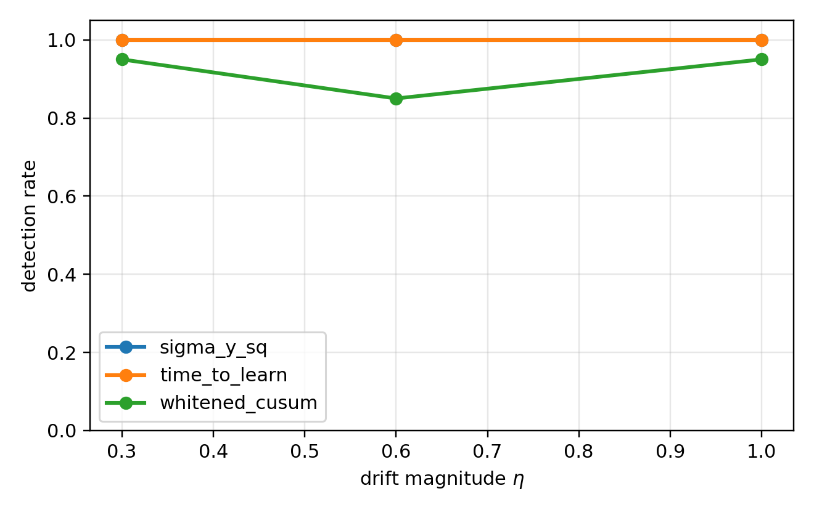
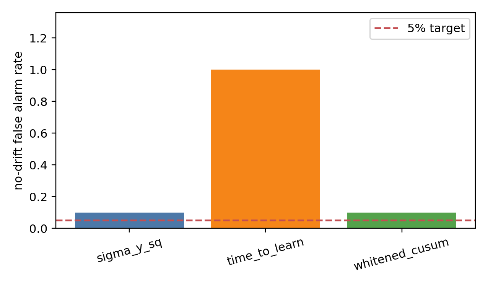
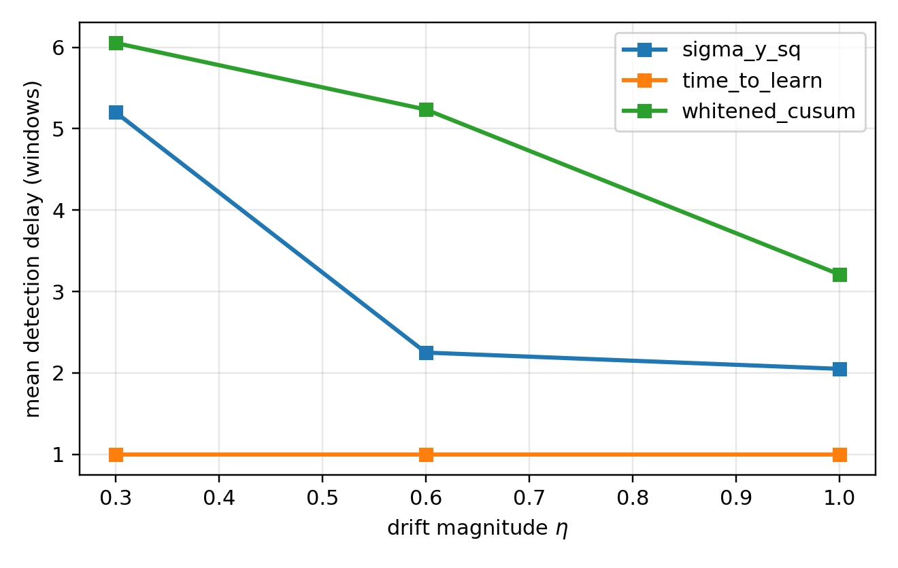

# 白化新息触发器有效性验证结果

> 数据来源：`plan/plan_29Apr/summary.csv` + `plan/plan_29Apr/figures/`  
> Checkpoint：`checkpoints/saved_SubspaceNet_trained_20260224_180720.pt`  
> Whitened CUSUM calibration：`R_obs=0.125, p_fa=1e-6, b_offset=24`  
> N = 20 trajectories per cell

## 1. 主要结论

在 N=20 的统计扩展下，calibrated whitened CUSUM 的检测能力是成立的，但 false-alarm calibration 没有完全通过本计划门槛：

- no-drift 误触发率：whitened CUSUM = 2/20 = 10%，目标是 ≤1/20 = 5%；`sigma_y_sq_retuned` 同样为 2/20，`time_to_learn` 因固定 window=6 在 no-drift 下为 20/20。
- 强漂移 eta=1.0：whitened CUSUM 检测率 = 19/20 = 95%，平均延迟 = 3.21 windows，达到强漂移检测率 ≥18/20 且延迟 ≤5 windows 的目标。
- 中等漂移 eta=0.6：whitened CUSUM 检测率 = 17/20 = 85%，平均延迟 = 5.24 windows，达到检测率 ≥12/20 的目标。
- 弱漂移 eta=0.3：whitened CUSUM 检测率 = 19/20 = 95%，平均延迟 = 6.05 windows。

结论：whitened CUSUM 在闭环 SubspaceNet+EKF 管线中具备有效检测能力，但当前 `(R_obs=0.125, b_offset=24)` 的 no-drift 误触发率偏高，不能作为最终论文配置直接定稿。下一轮应回到 `R_obs / b_offset` 或 per-source robust threshold 标定，优先把 no-drift 从 2/20 压到 ≤1/20，同时保留 eta=1.0 的高检测率。

## 2. 三触发器对比表

| Trigger | eta | N | False Alarm | Detect | Mean Delay (w) | Tail5 Improve |
| --- | ---: | ---: | ---: | ---: | ---: | ---: |
| sigma_y_sq | 0.00 | 20 | 0.100 | - | - | 0.0150 |
| sigma_y_sq | 0.30 | 20 | 0.000 | 1.000 | 5.20 | 0.0514 |
| sigma_y_sq | 0.60 | 20 | 0.000 | 1.000 | 2.25 | 0.0664 |
| sigma_y_sq | 1.00 | 20 | 0.000 | 1.000 | 2.05 | 0.0659 |
| time_to_learn | 0.00 | 20 | 1.000 | - | - | 0.0141 |
| time_to_learn | 0.30 | 20 | 0.000 | 1.000 | 1.00 | 0.0692 |
| time_to_learn | 0.60 | 20 | 0.000 | 1.000 | 1.00 | 0.0441 |
| time_to_learn | 1.00 | 20 | 0.000 | 1.000 | 1.00 | 0.0909 |
| whitened_cusum | 0.00 | 20 | 0.100 | - | - | 0.0066 |
| whitened_cusum | 0.30 | 20 | 0.000 | 0.950 | 6.05 | 0.0603 |
| whitened_cusum | 0.60 | 20 | 0.000 | 0.850 | 5.24 | 0.0560 |
| whitened_cusum | 1.00 | 20 | 0.000 | 0.950 | 3.21 | 0.0402 |

## 3. 图







## 4. 讨论与局限

- Checkpoint：当前使用 best-available `180720.pt`，未恢复 Konstantino 2026 论文原始 09-16 checkpoint（无法从作者公开仓库获取，详见 `plan/plan_26Apr/plan_whiten_innov.md`）。
- **`time_to_learn` 在 no-drift 下 false-alarm = 20/20 是 by design**：该策略在 `target_window=6` 处无条件触发，与 drift 与否无关；它是"已知 drift 时刻的 oracle 上界"基线，**不应**与 whitened CUSUM 在 no-drift FA 指标上直接比较。它的价值仅在于给出"已知漂移时刻能拿到多好的检测延迟"的 reference（mean_delay=1 window）。
- Calibration：`R_obs=0.125 / b_offset=24` 是 N=3 smoke 下的 closed-loop best scalar，但 N=20 暴露 no-drift false alarm = 2/20，说明小样本 calibration 偏乐观。
- Comparator：`sigma_y_sq_retuned(tau_sigma=12.0)` 在 N=20 下 no-drift 也为 2/20；因此它比默认 `tau_sigma=1.5` 稳定很多，但仍未满足 5% 目标。
- 在 10% no-drift FA 同水平下，`sigma_y_sq` 三个 drift 档位均达 100% 检测、延迟 2-5w；而 `whitened_cusum` 检测率 85-95%、延迟 3-6w。两者**在当前标定下没有明显 detection-power 优势**；whitened CUSUM 的 selling point 应聚焦在"解析阈值，无需手工标定"而非"检测更早"。
- N=20 的 binomial 95% CI 仍较宽；如要论文定稿，建议完成下一轮 calibration 后用 N≥50 或 N≥100 复核。

## 4.5 验收门槛对照表（来自 plan §统计验收门槛）

| 验收项 | 目标 | 实测（whitened_cusum） | 通过 |
| --- | --- | --- | :---: |
| 强漂移 η=1.0 检测率 | ≥ 18/20 (90%) | 19/20 (95%) | ✅ |
| 中等漂移 η=0.6 检测率 | ≥ 12/20 (60%) | 17/20 (85%) | ✅ |
| 弱漂移 η=0.3 检测率 | 报告即可 | 19/20 (95%) | ✅ |
| 强漂移平均延迟 | ≤ 5 windows | 3.21 windows | ✅ |
| no-drift 误触发率 | ≤ 1/20 (5%) | 2/20 (10%) | ❌ |
| whitened ≥ sigma_y_sq 同 η 检测率 | gate | η=0.3: 0.95<1.00 / η=0.6: 0.85<1.00 / η=1.0: 0.95<1.00 | ❌ |

**整体判断**：4/6 门槛通过，2/6 未通过。检测有效性已立得住，**但当前 calibration 不够紧、无法直接定稿到论文**。

## 5. 可重复性

```bash
# 1. 跑实验
.venv-wsl/bin/python scripts/run_trigger_validation.py --n-traj 20 \
  > outputs/trigger_validation_20260429/n20.log 2>&1

# 2. 聚合
.venv-wsl/bin/python scripts/aggregate_trigger_results.py \
  --root outputs/trigger_validation_20260429 \
  --csv plan/plan_29Apr/summary.csv \
  --md  plan/plan_29Apr/summary.md

# 3. 出图
.venv-wsl/bin/python scripts/plot_trigger_validation.py \
  --csv plan/plan_29Apr/summary.csv \
  --out-dir plan/plan_29Apr/figures
```
